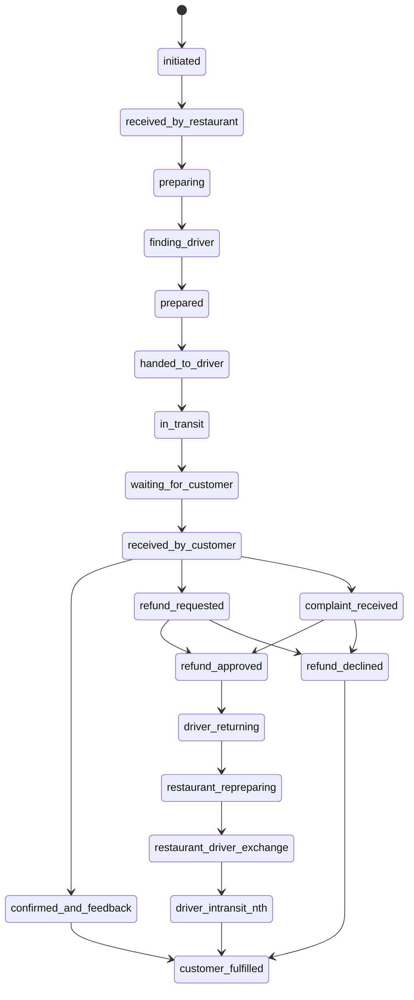
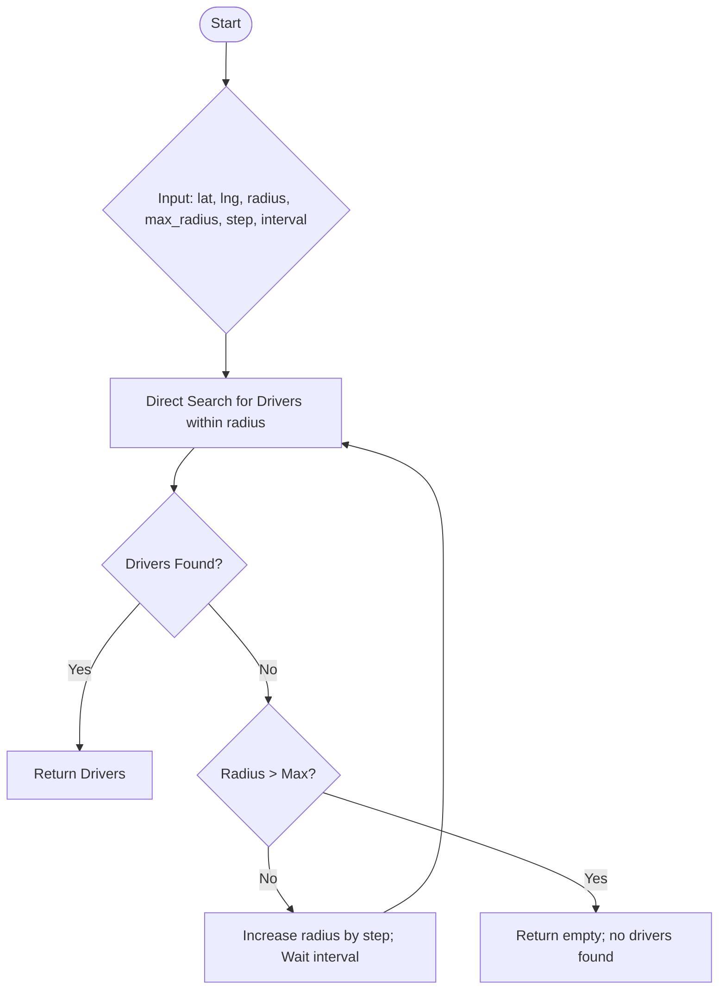

<p align="center"><a href="https://laravel.com" target="_blank"></a></p>

<p align="center">
<a href="https://github.com/laravel/framework/actions"></a>
<a href="https://packagist.org/packages/laravel/framework"></a>
<a href="https://packagist.org/packages/laravel/framework"></a>
<a href="https://packagist.org/packages/laravel/framework"></a>
</p>

## FoodTech Backend

This project is a **multi-tenant food delivery backend** built with Laravel 12, PostgreSQL, Filament, Stancl Tenancy, and Spatie Permission. It is designed for rapid development of food delivery platforms supporting restaurant chains, customers, drivers, and advanced business logic.

### Features
- Multi-tenancy (Stancl Tenancy)
- Role & permission management (Spatie Laravel Permission)
- Modern admin panel (Filament)
- Modular and scalable database structure for:
  - User & tenant management
  - Restaurants, branches, menus, orders
  - Delivery, reviews, promotions, payments, notifications, and logging

### Database Structure

See `/database/migrations/` for the full schema. Main modules and tables:

#### Multi-Tenancy & Users
- tenants
- users
- password_reset_tokens
- sessions

#### Permissions & Roles
- permissions
- roles
- model_has_permissions
- model_has_roles
- role_has_permissions

#### Business Entities
- food_chains
- restaurants
- restaurant_branches

#### Menu System
- menu_categories
- menu_items
- menu_item_variants
- branch_menu_item_overrides
- branch_menu_item_variant_overrides
- menu_add_ons
- menu_add_on_menu_item
- categories

#### Customers
- customer_profiles
- customer_addresses
- customers

#### Orders & Delivery
- orders
- order_items
- order_item_variants
- deliveries
- drivers

#### Promotions & Payments
- coupons
- coupon_usages
- payment_transactions

#### Notifications & Activity
- notifications
- activity_log

#### Reviews & Misc
- reviews

---

#### Order State Machine (Business Flow)
Below is a visualization of the allowed order state transitions as implemented in [`app/Domain/Order/OrderState.php`](app/Domain/Order/OrderState.php):

<a href="https://mermaid.live/edit#pako:eNqNVM1ymzAQfhXPHju2h3_bHHpJn6Klo1GQwJqARNZSmtTjd-8GLMdg4pQTu9_PrlYLRyiNkJDDwXIrfyheI29XL1GhF_T8-vZ7sVp9XyitrCJcDOlL2IMoS6lepGCPbwwl-Tjk2g7MeayXdSg7jkrXA_MS9mCltKB3JpDUODDGuSsP35aPemjPtaC61ow8ptnz6Ziltg7K-uP5uIf_cDot1a0MstIdrGm92xxyM5KxZA7pJaXRlcKWEGqRVVKKR14-fSFCWTlio3x2NFw_hzs12q7hSlvmKV4wtrn25l2H5r-YQpaN0p55W-tz1_vcse_EoCcOd0li61BfNmqaPXv6JSRgsoLz2FR2tpWvJS1TLW-kE_y6QTrhsFdM2_2oyREy3NX54ljlmko1zces5vbkrmQyx0-4sIQalYDcopNLIKzl7yEc310KsHvZygJyehUcnwoo9Ik0Hdc_jWm9DI2r95BXvDlQ5Drx8Ve5ZFHSR4gPxmkLebyJexPIj_AKeRRH6zQNo00Y7OIoTJMlvEEe7tZhskmiLM3CJAvSLD4t4W9fNlhvg3CX7rZZkMVxus2S0z8MI69a" target="_blank" rel="noopener noreferrer">Open Mermaid Diagram in New Tab</a>


---

### Driver Proximity Search Logic (`app/Jobs/SearchForNearbyDrivers.php`)

This job is responsible for finding available drivers within a given radius from a location. It supports both a direct search and a progressive search that expands the search radius until a driver is found or a maximum radius is reached.

#### How It Works
- **Direct Search:**
  - Find all available drivers within the specified radius using the Haversine formula.
  - For SQLite (test) environments, the calculation is performed in PHP; for production, it's done in SQL.
- **Progressive Search:**
  - Start with a default radius (e.g., 5km).
  - If no drivers are found, increase the radius by a step (e.g., +5km) every X minutes, up to a maximum (e.g., 20km).
  - Stop searching as soon as one or more drivers are found or the maximum radius is reached.

#### Flowchart


---

### Setup Instructions
1. **Clone & Install**
   ```bash
   git clone <repo-url>
   cd foodtech-backend
   composer install
   cp .env.example .env
   # Configure your DB connection in .env
   php artisan key:generate
   ```
2. **Install JS dependencies** (if needed)
   ```bash
   npm install && npm run build
   ```
3. **Run Migrations**
   ```bash
   php artisan migrate
   ```
4. **Install Packages**
   - [Spatie Permission](https://spatie.be/docs/laravel-permission/v6/introduction)
   - [Stancl Tenancy](https://tenancyforlaravel.com/docs/introduction/)
   - [Filament Admin](https://filamentphp.com/docs/3.x/admin/installation)

### Package Configuration
- **Stancl Tenancy:** See `config/tenancy.php` for tenant setup. Models use `tenant_id` for scoping.
- **Spatie Permission:** See `config/permission.php` for guard and model settings. Roles/permissions are ready for seeding.
- **Filament:** Admin panel is ready for resource generation for all major models.

### Next Steps
- Generate Filament Resources for admin CRUD UI
- Create Model Factories & Seeders for demo/test data
- Configure tenant-aware routes and middleware
- Set up authentication scaffolding (Breeze, Jetstream, or Fortify)

---
For more, see the `/app/Models/` directory and the migrations for details on relationships and architecture.

## Credits

**FoodTech Backend** is developed and maintained by John Gerwin De las Alas.

This project is built for the community as a foundation for modern, scalable, multi-tenant food delivery platforms. Contributions, suggestions, and forks are welcome!

## License

This software is released as **CopyFree** software by John Gerwin De las Alas.

You are free to use, modify, distribute, and build upon this project for any purpose, commercial or non-commercial, without restriction.

Attribution is appreciated but not required.

---

For questions, improvements, or to get in touch, please contact John Gerwin De las Alas.
